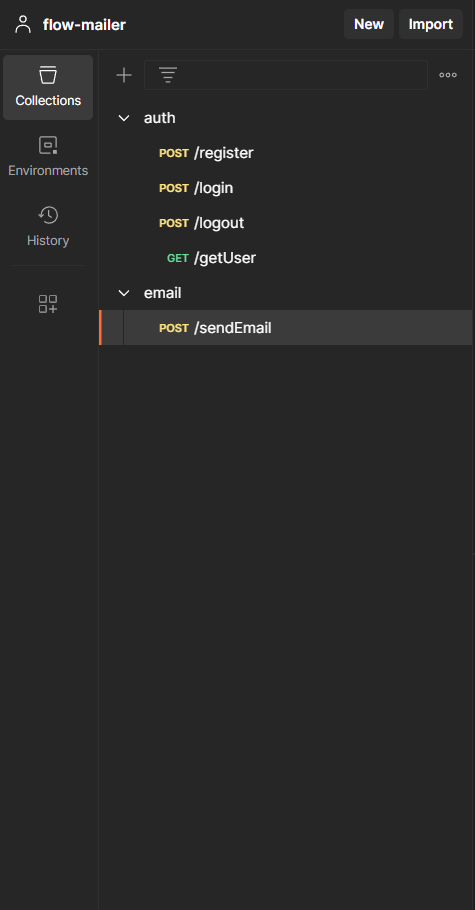

#Tech Stack for Frontend:

-React for building the user interface

-ShadCN for UI components

-Tailwind CSS with custom styling

-Redux Toolkit for efficient state management

#Backend techStack:

-Node.js for server-side logic

-Mongoose for database management

-JWT for user authentication

-Express for routing and middleware

-Agenda for Scheduling mails/jobs

-nodemailer to send mails

My apis
